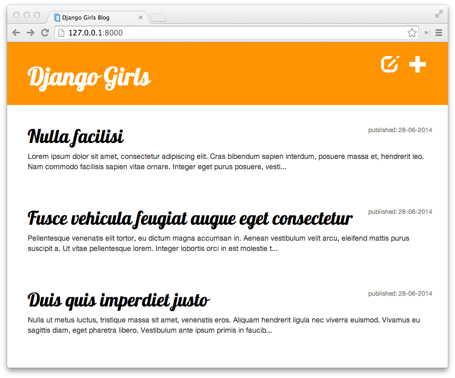

# First Django application: a blog

This repository is the result of me taking part in a hand-on workshop celebrated in 2019's PyDay. The workshop was organized by Django Girls Barcelona.

During the workshop we were following [this tutorial](https://tutorial.djangogirls.org/en/). Once we had finished the tutorial, the result was a small working web application: our own blog. Also putting it online, so others could see our work. It was supposed to look something like this:

It was my first time seeing the insides of a Django application and the different steps involved in creating it.

It is a work in progress as I did not finished that day. I still need to beautify it with css.
